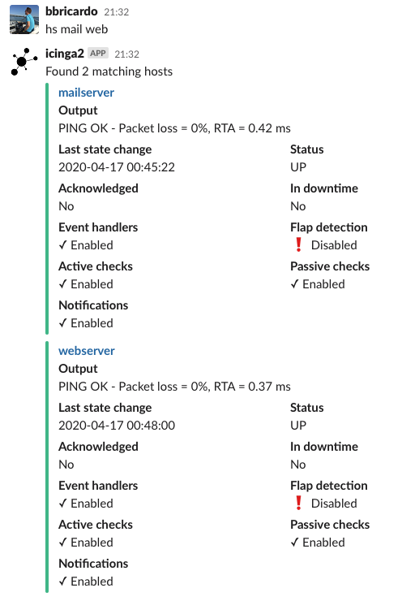

# icinga-slack-bot
use slack to manage alarms in Icinga2

It can be used to interact with Icinga2 from your Slack client. It uses the
Icinga2 API to get Host/Service status details. Simple status filters can be
used to narrow down the returned status list.


## Requirements
* python >= 3.6
* python-slackclient >= 2.0.0
* certifi >= 2018
* icinga2api >= 0.6.0
* ctparse >= 0.0.38
* Icinga2 instance with API feature enabled

## Installation

### Setting up icinga-slack-bot
* on RedHat/CentOS you need to install python3.6 and virtualenv from EPEL first
```
yum install python36-virtualenv
```

* setting up the virtual env would be done like this
```virtualenv-3.6 .pyenv``` instead of ```virtualenv .pyenv```

* here we assume we install the bot in ```/opt```
```
cd /opt
git clone https://github.com/bb-Ricardo/icinga-slack-bot.git
cd icinga-slack-bot
virtualenv .pyenv
. .pyenv/bin/activate
pip install -r requirements.txt
```

Now you would be able to start the bot with
```.pyenv/bin/python3 icinga-bot.py```

Most likely the start will fail as the config is not fully set up.
>**It is recommended to create your own config**
>```cp icinga-bot.ini.sample icinga-bot.ini```

Change config options according your environment.
After you entered the Slack tokens you should be able to start the bot.

### Run as a service
* a [systemd unit file](icinga-slack-bot.service) is included
but needs to be changed if the installation path is different

```
sudo cp icinga-slack-bot.service /etc/systemd/system
sudo systemctl daemon-reload
sudo systemctl start icinga-slack-bot
sudo systemctl enable icinga-slack-bot
```

### Run with Docker
```
git clone https://github.com/bb-Ricardo/icinga-slack-bot.git
cd icinga-slack-bot
docker build -t icinga-bot .
```

Copy the config from the [example](icinga-bot.ini.sample) to ```ìcinga-bot.ini``` and edit
the settings.

Now you should be able to run the image with following command
```
docker run -d -v /PATH/TO/icinga-bot.ini:/app/icinga-bot.ini --name bot icinga-bot
```

### Icinga API permissions
* necessary API permissions
  * objects/query/Host
  * objects/query/Service
  * status/query
  * actions/*

This would be an Icinga Slack bot API user
```
# vim /etc/icinga2/conf.d/api-users.conf

object ApiUser "icinga-bot" {
  password = "icinga"

  permissions = [ "objects/query/Host", "objects/query/Service", "status/query", "actions/*" ]
}
```

For further details check the [Icinga2 API documentation](https://icinga.com/docs/icinga2/latest/doc/12-icinga2-api)

### Get Slack Bot Token
[Here](https://www.fullstackpython.com/blog/build-first-slack-bot-python.html)
you can find a quick and helpful example on how to acquire a slack bot API token.
You can also use [this](contrib/icinga2_logo.png) icon to represent the bot in Slack properly.

## Configuration
icinga-slack-bot comes with a default [config file](icinga-bot.ini.sample)

## Run the bot
```
usage: icinga-bot.py [-h] [-c icinga-bot.ini] [-l {DEBUG,INFO,WARNING,ERROR}]
                     [-d]

This is an Icinga2 Slack bot.

It can be used to interact with Icinga2 from your Slack client. It uses the
Icinga2 API to get Host/Service status details. Simple status filters can be
used to narrow down the returned status list.

Version: 0.2.0 (2019-11-16)

optional arguments:
  -h, --help            show this help message and exit
  -c icinga-bot.ini, --config icinga-bot.ini
                        points to the config file to read config data from
                        which is not installed under the default path
                        './icinga-bot.ini'
  -l {DEBUG,INFO,WARNING,ERROR}, --log_level {DEBUG,INFO,WARNING,ERROR}
                        set log level (overrides config)
  -d, --daemon          define if the script is run as a systemd daemon
```

## Use the bot
Following commands are currently implemented:
* help
>display the bot help
* ping
>answers simply with pong if slack bot is running
* host status (hs)
>request a host status (or short "hs") of any or all hosts
* service status (ss)
>request a service status (or short "ss") of any or all services
* status overview (so)
>display a summary of current host and service status numbers
* acknowledge (ack)
>acknowledge problematic hosts or services
* downtime (dt)
>set a downtime for hosts/services
* reset (abort)
>abort current action (ack/dt)
* icinga status (is)
>print current Icinga status details

### Help command
Each command also provides a detailed help `help <command>`

### Command status filter
Following command filters are implemented
* host status
  * up
  * down
  * unreachable (unreach)
  * all
  * problems
* service status
  * ok
  * warning (warn)
  * critical (crit)
  * unknown
  * all
  * problems

Command filter can be combined like "warn crit" which would return all services in WARNING and CRITICAL state.
Also "problems" could be used to query all service with a certain name match in **NOT** OK sate.

***Important:***
* The default host status filter will only display hosts which are **NOT** UP
* The default service status filter will only display services which are **NOT** OK
* To display all host/service status just add the keyword **all** to your command

### Command name filter
You can add host names or services names to any status command.
Also just parts of host and service names can be used to search for objects

***Important:***
* when using the *service status* command only the **first two** names will be used as filter and all others are going to be ignored
* a command like `ss crit test web` will be converted into a filter like:
`
(service.state == 2) && ( match("*test*", host.name) && match("*web*", service.name) ) || ( match("*web*", host.name) && match("*test*", service.name) )
`

### Actions
Actions have been added to perform certain actions on hosts or services.
Current actions are `Acknowledgements` and `Downtimes`.

#### Acknowledgements
This command will start a dialog to set an acknowledgement for an unhandled service or host.
This can be started with this command and the bot will ask questions about the details on following order:
1. host/service filter
2. time when acknowledgement should expire (or never)
3. a comment which should be added to the acknowledgement

##### INFO: time can be submitted in a relative format like:
_tomorrow 3pm_, _friday noon_ or _monday morning_<br>
Or more specific like _january 2nd_ or even more specific like _29.02.2020 13:00_.
Just try and see what works best for you.<br>
At the end the bot will ask you for a confirmation which can be answered with `yes` or just `y` or `no`.
After that the bot will report if the action was successful or not.

##### SORT CUT:
It's also possible to short cut the whole Q/A and just issue the action in one command:
```
ack my-server ntp until tomorrow evening Wrong ntp config, needs update
```
This will acknowledge a problematic service ntp on my-server until 6pm the following day.

##### STRUCTURE:
```
ack <host> <service> until <time> <comment>
```
or
```
ack <host> until <time> <comment>
```
or
```
ack <service> until <time> <comment>
```

#### Downtimes
This command works pretty similar to the acknowledgement command except that the bot
will ask for a downtime start. Here it's also possible to use a relative time format.

##### SORT CUT:
It's also possible to short cut the whole Q/A and just issue the action in one command:
```
dt my-server ntp from now until tomorrow evening NTP update
```
This will set a downtime for the service ntp on my-server until 6pm the following day.

##### STRUCTURE:
```
dt <host> <service> from <time> until <time> <comment>
```
or
```
dt <host> from <time> until <time> <comment>
```
or
```
dt <service> from <time> until <time> <comment>
```

### Command examples
* ```hs down test``` will display all hosts in DOWN state which match "test" as host name like "testserver" or "devtest"
* ```hs all``` will return all hosts and their status
* ```hs``` will display all hosts which currently have a problem


* ```ss warn crit ntp``` will display all services which match "ntp" and are in state CRITICAL or WARNING
* ```ss``` will display all services which currently have a problem

* ```ack my-server ntp until tomorrow evening Wrong ntp config, will be updated tomorrow``` will acknowledge a problematic service ntp on my-server until 6pm the following day

***Important:***
* The [detailed](#all-problematic-services) view will only be used if there are **1 to 4** status results

#### Help


#### Detailed host status example


#### Detailed service status example


#### Service name filter examples


#### All problematic services


#### Status overview


#### Acknowledge service problem


#### Icinga status


### Startup messages
* once the bot starts it will report a short status to the configured default channel


## Alert notification
To get Slack notifications if something goes wrong you can check out the notification handlers in [contrib](contrib)

### Alert examples


## License
>You can check out the full license [here](LICENSE.txt)

This project is licensed under the terms of the **MIT** license.

### Saying Thank You
quite some inspiration came from [mlabouardy](https://github.com/mlabouardy) and his Go implementation
of a [slack bot](https://github.com/mlabouardy/icinga2-slack-bot)
